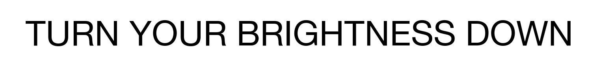
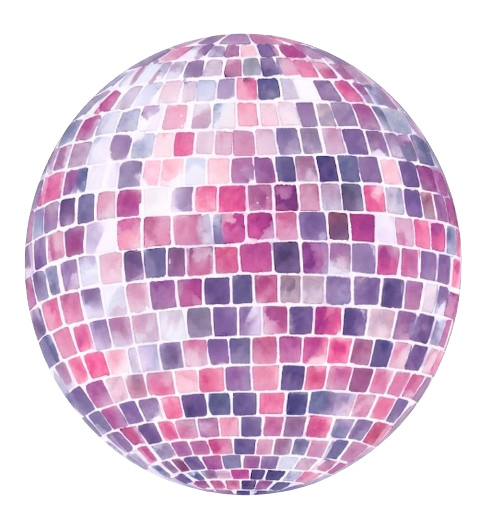
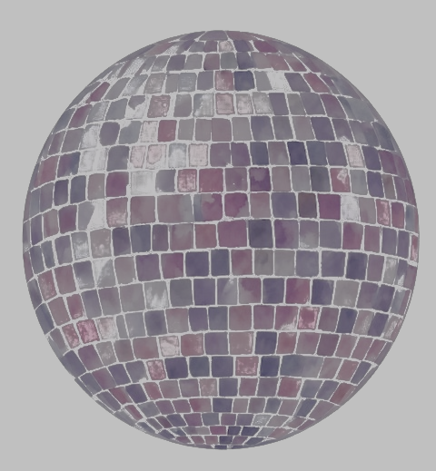
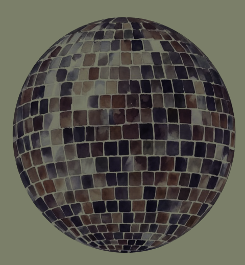

# image-luminescence




*(Both banners are outputs of this tool. On an HDR display their white
regions ignore your brightness slider -- try it in Chrome.)*

**Live demo:** [kwicz.github.io/image-luminescence](https://kwicz.github.io/image-luminescence/)
-- converts in your browser, no uploads, with glowing examples on any HDR
display.

Make ordinary images glow on HDR displays -- whites brighter than the
screen's normal white, staying bright even when the display dims -- while
keeping every color pixel-exact.

Point it at any sRGB PNG or JPEG:

```
python3 luminescence.py logo.png
```

and you get `logo-luminescence.jpg`: an Ultra HDR gain-map JPEG whose base
image is your original pixels, byte-for-byte, with near-white regions boosted
as bright as the viewer's display can go on HDR-capable systems. The glow
shows reliably in Chrome/Edge on HDR displays, on Android, and in iOS 17+
Photos; desktop viewers vary (macOS Preview shows correct colors without the
boost). Anywhere unsupported it renders as a completely normal image -- the
failure mode is "no glow," never "wrong colors." Judge your results in a
browser.

## Example

| Original | Luminesced (gain-map JPEG) | Luminesced (PQ PNG) |
| --- | --- | --- |
|  |  |  |

View this page in Chrome on an HDR display, then drag your screen brightness
down: everything dims except the right image's whites -- the background and
the grout between tiles hold their intensity. On an SDR screen (or in most
desktop image viewers) the two look identical, which is exactly the point.

How the right one looks tells you about *your* viewer: glowing means it
honors the PQ profile (Chrome), washed-out gray means it doesn't -- that's
the trade the PQ format makes (see "Two tools" below).

To reproduce: `python3 luminescence.py examples/disco-ball.png` and
`python3 luminescence_pq.py examples/disco-ball.png --cicp --depth 8`

### Why this tool exists

Before this tool, there were two ways to attempt an HDR glow, and each ruins
the image in its own way:

| ImageMagick ICC profile conversion | Naive HDR profile tag |
| --- | --- |
|  |  |
| `magick in.png -profile sRGB.icc -profile rec2020_pq.icc` rewrites the pixels -- badly. Pure white becomes murky green-gray `rgb(123,127,105)`, every color drifts with it, and there is no glow to show for it. | Untouched sRGB pixels tagged with an HDR profile. This one really glows on an HDR display -- but every color is reinterpreted in the wrong gamut, turning the pastel watercolor hot neon pink. |

This tool exists to do neither: your pixels stay exactly what you authored,
and the glow rides alongside as gain-map metadata.

## Two tools, two strategies

This repo ships two converters because destinations break images in two
different ways. Pick by where the image is going:

- **`luminescence.py` (gain-map JPEG) -- the default.** The glow travels as
  removable metadata next to your untouched pixels. Glows in Chrome/Edge,
  Android, and iOS 17+ Photos. Worst case, a pipeline strips the metadata
  and the image simply looks normal (verified: Slack does this). Use it for
  web pages, direct file sharing, and any destination you haven't tested.
- **`luminescence_pq.py` (PQ PNG) -- for re-encoding pipelines you've
  verified.** The glow is baked into the pixel values themselves with a PQ
  color profile, so it survives pipelines that preserve PNGs and their
  profiles (verified: LinkedIn -- this is how those glowing company icons
  work). Worst case is ugly: a viewer that ignores the profile shows a
  washed-out gray ghost (verified: Slack previews). Only use it where
  you've seen it work.

Rule of thumb: gain-map JPEG unless the destination re-encodes it to
death AND you've confirmed the PQ PNG renders there.

## HDR reveal: one file, two pictures

`luminescence_reveal.py` pushes the gain map further: instead of boosting
one image's whites, the map stores the per-pixel ratio *between two
different images* -- so SDR viewers see picture A while HDR viewers watch
the file become picture B.

```
python3 luminescence_reveal.py everyone-sees-this.png hdr-sees-this.png
```

- `--headroom 2` (default): a clean switch -- SDR world gets A, HDR world
  gets B. Values below ~2 render unreliably in Chrome.
- `--headroom 4` to `8`: the reveal becomes a gradual A-to-B crossfade
  driven by the viewer's brightness slider -- dimming the screen literally
  fades one picture into the other.
- Bonus: thumbnails are rendered from the SDR base, so the thumbnail always
  shows A even where the full view shows B.
- The revealed image renders at normal brightness (this is a picture swap,
  not a flashbang), and both images get their black floor lifted to 8/255
  so the ratios stay encodable.

### See it

| Everyone sees | HDR displays reveal | The reveal file |
| --- | --- | --- |
|  |  |  |

The first two are ordinary images -- the ingredients. The third is one
file made from both: on an SDR screen (or in a viewer that ignores gain
maps) it looks identical to the first; in Chrome on an HDR display it
becomes the second. Same bytes either way -- even its thumbnail and its
full view can disagree.

To reproduce: `python3 luminescence_reveal.py examples/disco-ball.png examples/aang.jpg`
Or use the [reveal room on the site](https://kwicz.github.io/image-luminescence/#reveal).

## What displays show the glow

Two things must both be true: the *software* applies the gain map (Chrome or
Edge on desktop, Android, iOS 17+ Photos), and the *screen* has brightness
headroom to glow into.

- **Glows**: MacBook Pro 2021+ (XDR panels -- the dramatic case), other Mac
  laptops from roughly 2016 (gently, when dimmed), Pro Display XDR, iPhone
  12+, most OLED phones, and true HDR monitors/TVs (roughly 2016+; marketing
  "HDR400" monitors barely count).
- **No glow**: SDR-era screens -- Apple's Thunderbolt Display and other older
  monitors, most office displays, projectors. They show correct colors,
  nothing more; a MacBook that glows will stop glowing when the window moves
  to an SDR external monitor.
- Quick self-test: the [live demo](https://kwicz.github.io/image-luminescence/)
  detects your display and reports "glow-ready" or "no hdr headroom" in the
  page footer.
- Headroom shrinks as screen brightness rises. The glow is strongest on a
  dimmed screen and can vanish entirely at maximum brightness.

## What kind of images work best

The glow is applied to pixels that are already near-white, so the effect
lives or dies on where your whites are:

- **Best**: graphics whose whites represent light -- logos with white
  marks or text, icons, sparkles and highlights, line art on colored
  backgrounds. Small, intentional white areas read as "lit up."
- **Good**: artwork with scattered near-white highlights -- they glow like
  catchlights.
- **Works, but loud**: anything on a large white background -- the whole
  background glows. Striking for a hero image, blinding in a document.
- **No visible effect**: images with nothing near white (a dark photo, a
  saturated illustration). Nothing crosses the knee, so nothing glows;
  lower `--knee` to pull the glow deeper into the midtones.
- **Transparency**: JPEG output flattens alpha onto white, and that white
  background will glow. If you don't want a glowing backdrop, composite
  your art onto a colored background first.

## How it works

A gain-map file contains two images: your untouched sRGB image, plus a small
grayscale "boost stencil" marking which pixels may exceed SDR white and by
how much. HDR-aware viewers apply the stencil; everything else ignores it.
Because the base image is literal sRGB data, color fidelity is structural --
there is no tone mapping, reference white, or per-display calibration in the
loop. (We learned this the hard way; see LIMITATIONS.md for why the
PQ-based alternative cannot guarantee a 1:1 color match.)

The stencil is generated automatically: pixels above a brightness knee
(default 85%) ramp smoothly up to the boost ceiling, scaled per-pixel across
all three channels equally so chromaticity never drifts. Anti-aliased edges
ramp smoothly -- no halos.

## Install

```
git clone https://github.com/kwicz/image-luminescence
cd image-luminescence
brew install imagemagick libultrahdr
```

Python 3 with numpy. Macs with Xcode Command Line Tools have numpy bundled;
otherwise: `pip3 install numpy`

Other ways to run it:

- **pip**: `pip install .` from the clone installs `luminesce` and
  `luminesce-pq` commands (ImageMagick + libultrahdr still come from brew).
- **Finder Quick Action**: `./tools/install-quick-action.sh`, then
  right-click any image -> Quick Actions -> Luminesce.
- **Figma plugin**: import `figma-plugin/manifest.json` via Plugins ->
  Development; converts the selected layer. See `figma-plugin/README.md`.
- **Homebrew**: `brew tap kwicz/tap && brew install image-luminescence`
  (newer Homebrew asks for a one-time `brew trust kwicz/tap`).

## Usage

From the `image-luminescence` folder -- the `cd` above puts you there. (In a
new terminal window, `cd` back into wherever you cloned it first; commands
run from other folders will fail with "can't open file luminescence.py".)

```
python3 luminescence.py input.png
```

Output lands next to the input as `input-luminescence.jpg`. Options (add any
of these to the command):


- `-o out.jpg`  choose the output path
- `--boost`  max brightness of whites, as a multiple of SDR white. The
  default is the format's ceiling (10000 nits, about 49x), which means
  "as bright as the viewer's display can physically go" -- every screen
  clamps to its own maximum headroom. Pass a lower value for a gentler glow
- `--knee`   how bright a pixel must be (0-1) before it starts to glow
  (default 0.85; raise to 0.95 to restrict glow to near-pure whites)
- `--quality` JPEG quality for the base and gain map (default 95)

Notes: output is JPEG, so transparency is flattened onto white. If the input
is already a JPEG its bytes are kept verbatim as the base image.

### PQ fallback: luminescence_pq.py

```
python3 luminescence_pq.py input.png --cicp
```

Options: `--nits` (peak, default 1000), `--sdr-nits` (default 203), `--knee`,
`--depth 8` or `16`, `--uniform`.


Produces a 16-bit Rec.2020 PQ PNG (embedding `rec2020-pq-reference.icc`,
plus a `cICP` chunk with `--cicp`). Use this only for destinations that
support PQ PNGs but not gain-map JPEGs, and accept that PQ's absolute
luminance model means non-glowing colors can drift a few percent in
lightness depending on the viewer's display and brightness setting -- hue
never shifts. `--uniform` scales the whole image instead of only highlights.

## Tests

```
./test_luminescence.sh
```

Verifies profile embedding, white neutrality, exact color round-trips, and
that highlight mode holds colors at SDR level while whites hit the peak.

## Accessibility

Luminesced images don't violate accessibility guidelines -- the glow is
static (no flashing, so WCAG's photosensitivity thresholds don't apply),
colors and contrast are unchanged, and on SDR displays or non-supporting
apps the image is simply normal. But guidelines lag the technology, and
"compliant" isn't the same as "considerate": these images deliberately
exceed the brightness the viewer chose for their screen, and there is no
built-in way for them to opt out. Someone reading in a dark room, or
sensitive to bright light, experiences your glow at full strength.

So use it thoughtfully. This is a for-fun, decorative effect -- logos,
celebration graphics, a bit of sparkle -- not something to put behind body
text, essential UI, or anything a person is forced to look at to get
something done. Small glowing accents delight; full-bleed glowing
backgrounds in someone's feed are the visual equivalent of autoplay audio.

## Roadmap

- Free client-side website -- [live](https://kwicz.github.io/image-luminescence/)
- Figma plugin -- in `figma-plugin/`, import-ready (Community publish pending)
- macOS Finder Quick Action -- `tools/install-quick-action.sh`
- pip -- `pip install .` works (PyPI publish pending)
- Homebrew -- live: `brew tap kwicz/tap && brew install image-luminescence`
